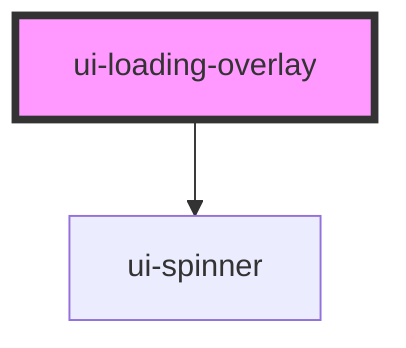

# ui-loading-overlay

<!-- Auto Generated Below -->

## Overview

Sobreposição de carregamento que cobre o elemento pai.
O host pai deve ter `position: relative` para que a sobreposição
absoluta (inset 0) o cubra corretamente.

## Properties

| Property      | Attribute      | Description                               | Type                   | Default     |
| ------------- | -------------- | ----------------------------------------- | ---------------------- | ----------- |
| `label`       | `label`        | Texto opcional exibido abaixo do spinner. | `string \| undefined`  | `undefined` |
| `spinnerSize` | `spinner-size` | Tamanho do spinner.                       | `"lg" \| "md" \| "sm"` | `"md"`      |
| `visible`     | `visible`      | Controla a exibição da sobreposição.      | `boolean`              | `false`     |

## Dependencies

### Depends on

- [ui-spinner](../ui-spinner)

### Graph

----------------------------------------------

*Built with [StencilJS](https://stenciljs.com/)*
