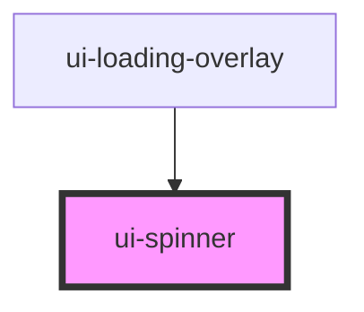

# ui-spinner

<!-- Auto Generated Below -->

## Properties

| Property | Attribute | Description         | Type                   | Default |
| -------- | --------- | ------------------- | ---------------------- | ------- |
| `size`   | `size`    | Tamanho do spinner. | `"lg" \| "md" \| "sm"` | `"md"`  |

## Dependencies

### Used by

 - [ui-loading-overlay](../ui-loading-overlay)

### Graph

----------------------------------------------

*Built with [StencilJS](https://stenciljs.com/)*
