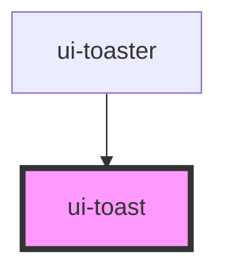

# ui-toast

<!-- Auto Generated Below -->

## Properties

| Property      | Attribute     | Description                              | Type                                              | Default     |
| ------------- | ------------- | ---------------------------------------- | ------------------------------------------------- | ----------- |
| `description` | `description` | Descrição do toast.                      | `string \| undefined`                             | `undefined` |
| `duration`    | `duration`    | Tempo em ms até o auto-dismiss.          | `number`                                          | `4000`      |
| `heading`     | `heading`     | Título do toast.                         | `string \| undefined`                             | `undefined` |
| `open`        | `open`        | Controla a visibilidade do toast.        | `boolean`                                         | `false`     |
| `variant`     | `variant`     | Variante visual (afeta a borda lateral). | `"danger" \| "default" \| "success" \| "warning"` | `"default"` |

## Events

| Event     | Description                                                 | Type                |
| --------- | ----------------------------------------------------------- | ------------------- |
| `uiClose` | Emitido quando o toast é fechado (timer, close() ou botão). | `CustomEvent<void>` |

## Methods

### `close() => Promise<void>`

Fecha o toast imperativamente.

#### Returns

Type: `Promise<void>`

### `show() => Promise<void>`

Abre o toast imperativamente.

#### Returns

Type: `Promise<void>`

## Dependencies

### Used by

 - [ui-toaster](../ui-toaster)

### Graph

----------------------------------------------

*Built with [StencilJS](https://stenciljs.com/)*
