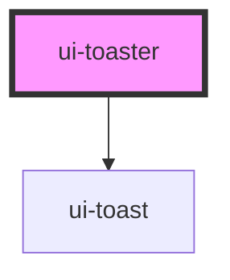

# ui-toaster

<!-- Auto Generated Below -->

## Methods

### `toast(opts: UiToastOptions) => Promise<void>`

Enfileira um novo toast imperativamente.

#### Parameters

| Name   | Type             | Description |
| ------ | ---------------- | ----------- |
| `opts` | `UiToastOptions` |             |

#### Returns

Type: `Promise<void>`

## Dependencies

### Depends on

- [ui-toast](../ui-toast)

### Graph

----------------------------------------------

*Built with [StencilJS](https://stenciljs.com/)*
